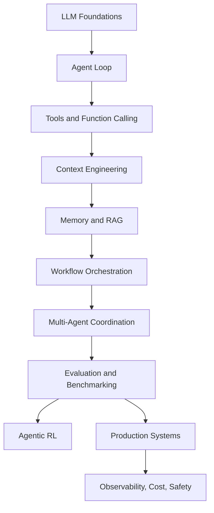

# AgentSystems101

[](https://github.com/TERAKYTE/AgentSystems101/actions/workflows/validate.yml)
[](./LICENSE)
[](#what-this-repository-covers)

AgentSystems101 is a Terakyte-maintained engineering handbook for building AI agent systems. It gives engineers a practical path from LLM fundamentals to agent orchestration, tool use, memory, retrieval, evaluation, and production operations.

The repository preserves upstream lineage for compatibility and attribution, but the active handbook is edited as an English-first learning resource rather than a literal translation.

This repository is not a claim that agents are fully autonomous software replacements. It treats agents as an emerging engineering pattern: useful when tool use, state, retrieval, planning, and evaluation are designed carefully; fragile when prompts are treated as architecture.

## What This Repository Covers

- LLM foundations and agent concepts
- Agent loops, ReAct, planning, reflection, and tool use
- Context engineering, memory systems, and RAG
- Agent frameworks and workflow orchestration
- Agent communication protocols and multi-agent systems
- Agent evaluation, benchmarks, and failure analysis
- Agentic RL and training workflows
- End-to-end projects and community examples
- Production concerns: observability, cost, safety, and reliability

## Why It Is Different

- **Engineering-first:** every topic is framed around implementation choices, constraints, and failure modes.
- **Progressive curriculum:** concepts build from LLM foundations to production systems.
- **Validation-backed:** active docs, links, examples, and English-first content are checked by repository validation.
- **Extensible structure:** examples, reference docs, archived upstream material, and production guidance are separated cleanly.

## Architecture Map



## Recommended Learning Order

| Stage | Read | Outcome |
| --- | --- | --- |
| 1 | [Foundations](./foundations) | Understand agent definitions, history, and LLM limits. |
| 2 | [Agent Patterns](./agent-patterns) | Implement ReAct, planning, reflection, and tool-augmented loops. |
| 3 | [Frameworks](./frameworks) | Compare low-code tools, agent frameworks, and a from-scratch framework. |
| 4 | [Memory and RAG](./memory-rag) | Add persistent memory, retrieval, and context management. |
| 5 | [Multi-Agent](./multi-agent) | Understand MCP, A2A, ANP, and coordination boundaries. |
| 6 | [Evaluation](./evaluation) | Measure task success, tool-call quality, and benchmark behavior. |
| 7 | [RL Agents](./rl-agents) | Study SFT, reward modeling, GRPO, and agentic training workflows. |
| 8 | [Projects](./projects) | Apply the concepts to product-like systems and capstone work. |

## Chapter Navigation

| Chapter | Topic | Section |
| --- | --- | --- |
| 01 | [Introduction to Agents](./foundations/01-introduction-to-agents.md) | Foundations |
| 02 | [History of Agents](./foundations/02-history-of-agents.md) | Foundations |
| 03 | [Large Language Models](./foundations/03-large-language-models.md) | Foundations |
| 04 | [Classic Agent Patterns](./agent-patterns/04-classic-agent-patterns.md) | Agent Patterns |
| 05 | [Low-Code Agent Platforms](./frameworks/05-low-code-agent-platforms.md) | Frameworks |
| 06 | [Framework Development Practice](./frameworks/06-framework-development-practice.md) | Frameworks |
| 07 | [Build Your Agent Framework](./frameworks/07-build-your-agent-framework.md) | Frameworks |
| 08 | [Memory and Retrieval](./memory-rag/08-memory-and-retrieval.md) | Memory and RAG |
| 09 | [Context Engineering](./memory-rag/09-context-engineering.md) | Memory and RAG |
| 10 | [Agent Communication Protocols](./multi-agent/10-agent-communication-protocols.md) | Multi-Agent |
| 11 | [Agentic RL](./rl-agents/11-agentic-rl.md) | RL Agents |
| 12 | [Agent Performance Evaluation](./evaluation/12-agent-performance-evaluation.md) | Evaluation |
| 13 | [Intelligent Travel Assistant](./projects/13-intelligent-travel-assistant.md) | Projects |
| 14 | [Automated Deep Research Agent](./projects/14-automated-deep-research-agent.md) | Projects |
| 15 | [Building Cyber Town](./projects/15-building-cyber-town.md) | Projects |
| 16 | [Capstone Project](./projects/16-capstone-project.md) | Projects |

## Repository Layout

```text
AgentSystems101/
|-- docs/              # Handbook references, glossary, production guidance, attribution
|-- foundations/       # LLM and agent fundamentals
|-- agent-patterns/    # ReAct, planning, reflection, tool-use patterns
|-- memory-rag/        # Context engineering, memory, retrieval, RAG
|-- frameworks/        # Low-code tools, agent frameworks, from-scratch framework
|-- multi-agent/       # Agent communication and coordination protocols
|-- evaluation/        # Benchmarks, evaluation design, reporting
|-- rl-agents/         # Agentic RL and training workflows
|-- projects/          # Capstone projects and community submissions
|-- examples/          # Curated English runnable examples
|-- assets/            # Images and static assets
|-- notebooks/         # Notebook index and notebook guidance
`-- scripts/           # Maintenance and validation scripts
```

## Quickstart

```bash
git clone https://github.com/<your-org>/AgentSystems101.git
cd AgentSystems101
```

Read the handbook first:

```text
README.md
docs/navigation.md
foundations/01-introduction-to-agents.md
agent-patterns/04-classic-agent-patterns.md
```

Run the dependency-light examples:

```bash
python examples/minimal-agent-loop.py
python examples/tool-use-agent.py
python examples/rag-memory-workflow.py
python examples/evaluation-harness.py
```

Archived upstream examples are available under `docs/upstream-zh/examples` for reference. Many of those projects call external LLM APIs or platform services; inspect their local `README.md` or `.env.example` before running them. Do not commit secrets.

## Prerequisites

- Python 3.10 or newer
- Basic command-line and Git experience
- Familiarity with HTTP APIs and JSON
- Basic LLM API usage
- Optional: Node.js for frontend demos and MCP examples
- Optional: Docker for vector databases, graph databases, and local services

## Framework Comparison

| Framework or Platform | Best Fit | Strength | Main Tradeoff |
| --- | --- | --- | --- |
| Dify | Low-code LLM applications | Fast prototyping, integrated workflow UI | Less control over deep orchestration details |
| Coze | Consumer-facing bot workflows | Fast bot assembly and tool wiring | Platform-specific deployment model |
| n8n | Business workflow automation | Strong integration ecosystem | LLM reasoning is one step in a broader workflow |
| AutoGen | Conversation-based multi-agent systems | Natural role decomposition | Debugging emergent conversations can be hard |
| AgentScope | Engineered multi-agent applications | Message passing and lifecycle structure | More framework surface area to learn |
| CAMEL | Role-playing agent collaboration | Simple pattern for cooperative agents | Less deterministic than explicit workflow graphs |
| LangGraph | Stateful agent workflows | Explicit graph control, cycles, persistence | Requires careful state and edge design |
| From-scratch framework | Learning and customization | Maximum transparency | You own reliability, tooling, and maintenance |

See [Framework Comparison](./docs/framework-comparison.md) for a deeper matrix.

## Engineering Principles

- Treat prompts as configuration, not architecture.
- Make tool contracts explicit and testable.
- Separate short-term context, long-term memory, and external retrieval.
- Add evaluation before optimizing prompts.
- Log model inputs, tool calls, observations, and final decisions.
- Prefer bounded workflows when failure cost is high.
- Keep humans in the loop for irreversible actions.

## Validation

Use the validation script before publishing changes:

```bash
node scripts/validate_repo.mjs
npx markdownlint-cli2
```

The validation script checks UTF-8 readability, active English-only content, Markdown fence balance, duplicate headings in each file, local Markdown links, notebook JSON parsing, and Python syntax compilation for active scripts and examples.

## Contributing

Contributions should improve clarity, correctness, or reproducibility.

1. Keep code behavior intact unless the issue is explicitly about code.
2. Preserve runnable examples and notebook structure.
3. Use technical English, not literal translation.
4. Prefer smaller pull requests grouped by topic.
5. Include validation output when changing docs, links, notebooks, or examples.
6. Clearly mark uncertain translations with a TODO instead of guessing.

See [CONTRIBUTING.md](./CONTRIBUTING.md) for contribution standards and local checks. A repository social preview asset is available at [assets/brand/agentsystems101-social-preview.svg](./assets/brand/agentsystems101-social-preview.svg).

## Attribution

AgentSystems101 includes an English-first restructuring and editorial adaptation of upstream educational material. Original authors and contributors retain credit for source curriculum material, code examples, images, and community projects. Original-language source material is preserved under [docs/upstream-zh](./docs/upstream-zh), and legacy English upstream material is preserved under [docs/upstream-legacy](./docs/upstream-legacy).

See [NOTICE](./NOTICE) for fork lineage and upstream attribution details.

## License

This repository preserves the upstream license lineage. The upstream project is licensed under the Creative Commons Attribution-NonCommercial-ShareAlike 4.0 International License. See [LICENSE.txt](./LICENSE.txt) and the upstream repository for authoritative licensing details.
