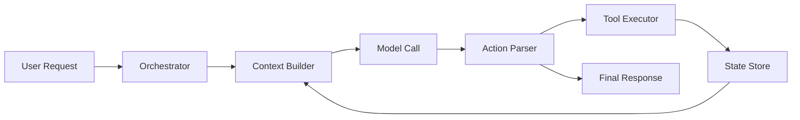

# Build From Scratch

A minimal agent system needs fewer parts than most frameworks suggest. Add complexity only when the task forces it.

## Minimal Architecture

## Core Interfaces

| Component | Responsibility |
| --- | --- |
| Orchestrator | Owns the loop, budgets, stopping rules, and error handling. |
| Context Builder | Selects instructions, task state, retrieved context, and memory. |
| Model Client | Calls the model with explicit settings and trace metadata. |
| Action Parser | Converts model output into final answers or tool calls. |
| Tool Executor | Validates tool arguments and executes allowed side effects. |
| State Store | Persists task state, conversation state, memory, and traces. |

## Build Order

1. Implement a one-step model call.
2. Add one typed tool.
3. Add a bounded agent loop.
4. Add state persistence.
5. Add retrieval only when a task needs external knowledge.
6. Add memory only when cross-session state improves the task.
7. Add evaluation before adding more agents.

