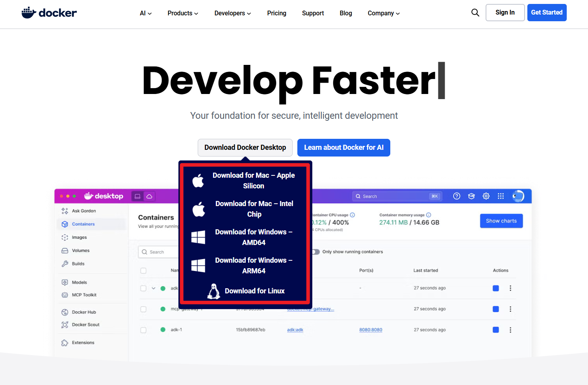
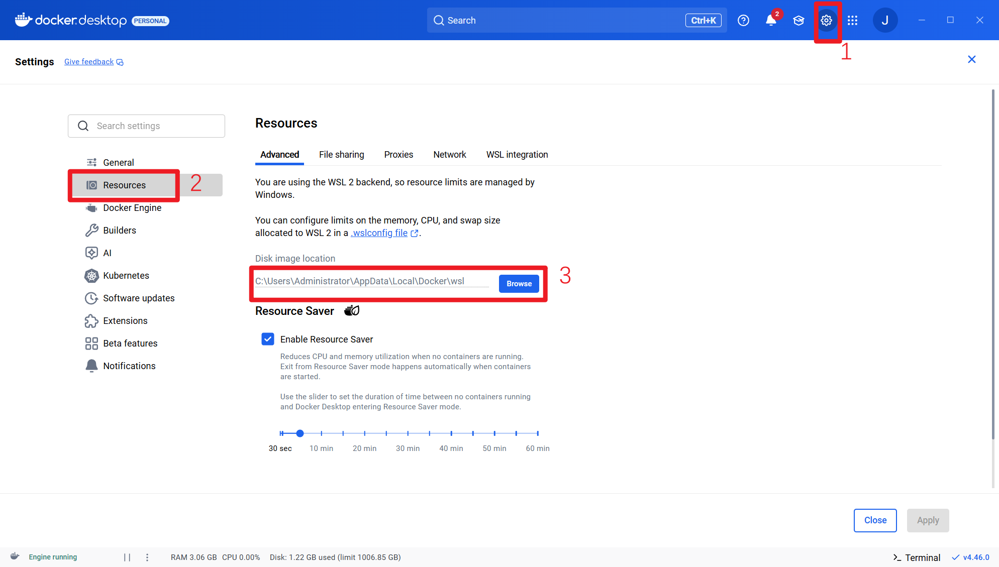
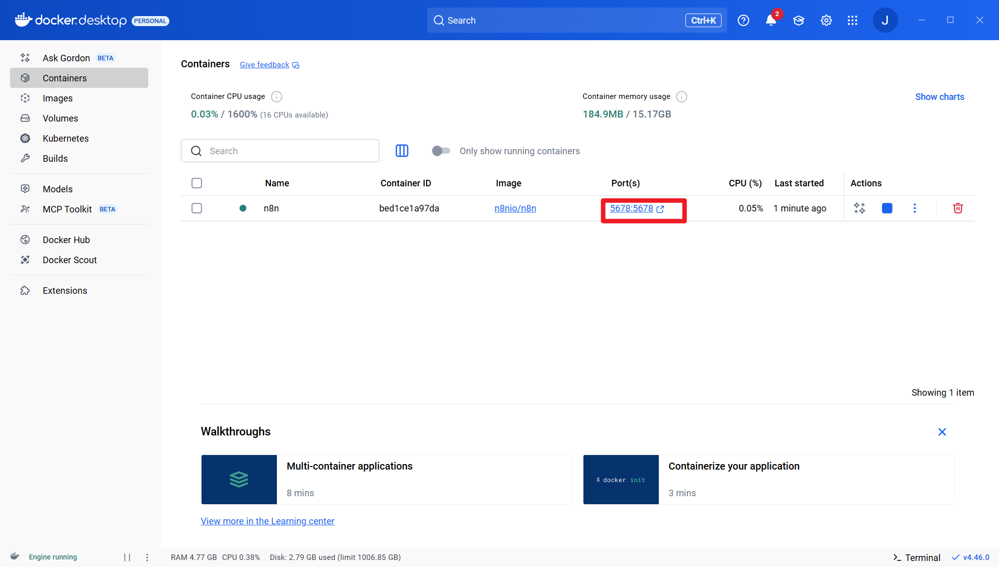
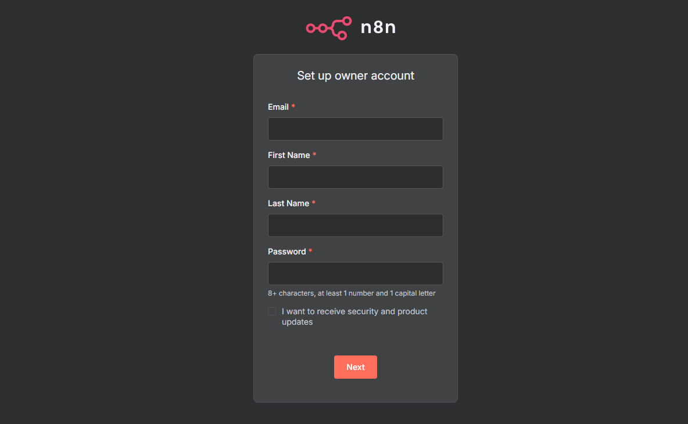
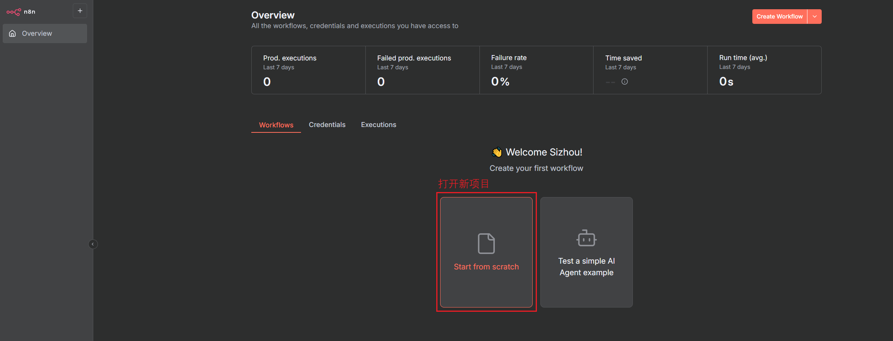
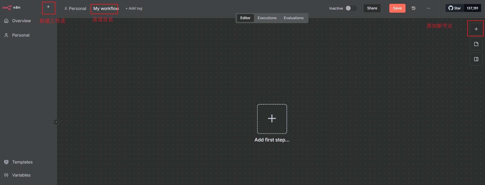
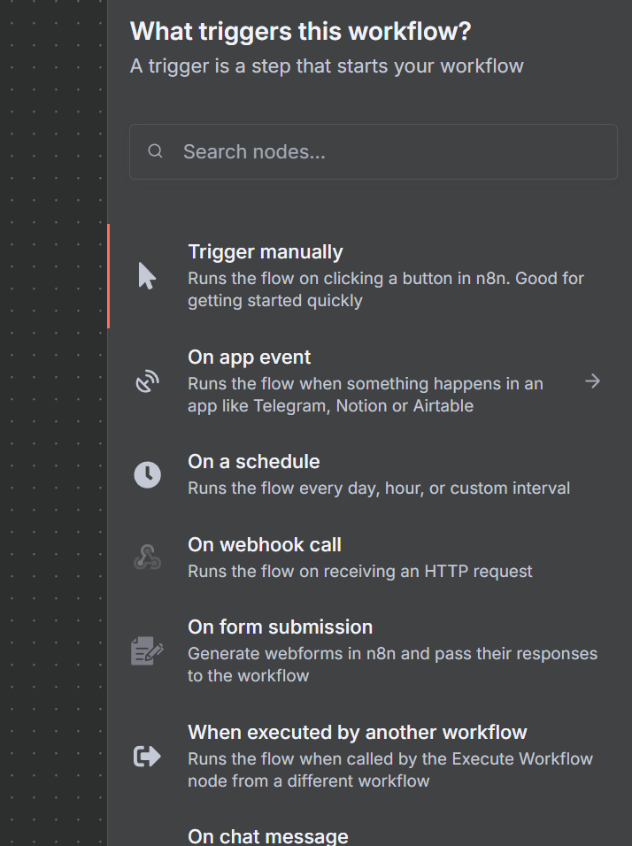

# Installing n8n Locally with Docker

This guide uses Docker because it is the most stable local setup for experimenting with n8n workflows.

## 1. Install Docker

Download Docker Desktop from the official site:

[https://www.docker.com/](https://www.docker.com/)

Choose the installer for your operating system. The screenshots below use Windows.



During installation, you can choose a non-system drive for Docker data if your machine has limited space on `C:`.



## 2. Start n8n

Open PowerShell, Terminal, or another shell and run:

```bash
docker volume create n8n_data
docker run -d --restart unless-stopped --name n8n -p 5678:5678 -v n8n_data:/home/node/.n8n n8nio/n8n
```

Docker should now show the n8n container running.



## 3. Open the n8n UI

Open:

[http://localhost:5678](http://localhost:5678)

The Docker port mapping `5678:5678` exposes the n8n web UI on your local machine.



After setup, create a new workflow from the n8n dashboard.



## 4. Add Nodes

The main workflow surface has three common areas: workflow canvas, node search, and execution/testing controls.



Use the add-node button to search for integrations or select nodes from the catalog.



## Operational Notes

- Keep credentials in n8n credential storage, not in plain workflow notes.
- Pin input/output examples when testing LLM nodes.
- Version important workflows by exporting JSON and committing sanitized copies.
- Stop the container with `docker stop n8n` when it is not needed.
